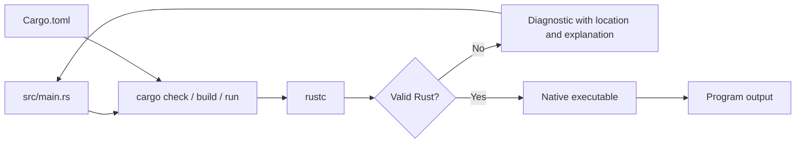

# Lesson 1 — Cargo and the Compiler

## Goal

Understand the path from a `.rs` source file to a running program, and become
comfortable with the basic Cargo workflow.

## The three tools

- `rustup` installs and updates Rust toolchains.
- `rustc` compiles Rust source code.
- Cargo creates projects, invokes the compiler, runs tests, and manages
  dependencies.

For normal projects, you will interact mostly with Cargo.



## Anatomy of the first program

```rust
fn main() {
    println!("Delivery Desk");
}
```

- `fn` declares a function.
- `main` is where a binary program begins.
- Braces delimit the function body.
- `println!` prints a line. The `!` indicates a macro invocation.
- The semicolon completes this statement.

Rust formatting is conventional and automated. Let `cargo fmt` settle arguments
about spaces and line wrapping.

## Predict

Before running this code, decide whether it compiles:

```rust
fn main() {
    println("Delivery Desk");
}
```

Then run `cargo check`. The compiler explains that `println` is a macro and
suggests the missing `!`. Notice that the diagnostic teaches syntax rather than
only reporting failure.

## Try it

```console
cargo new delivery_estimator
cd delivery_estimator
cargo run
cargo check
cargo fmt
```

Inspect `Cargo.toml`, `src/main.rs`, and the generated `target` directory. Source
and package configuration belong in version control; compiled files in `target`
normally do not.

## Build the project: checkpoint 1

Change `main` so it prints this fixed report:

```text
Delivery Desk
Distance: 12 km
Estimated time: 34 minutes
```

Use formatting placeholders for the values:

```rust
let distance_km = 12;
println!("Distance: {distance_km} km");
```

You do not need to understand `let` fully yet. It is the subject of Lesson 2.

## Common traps

- Running Cargo from a directory that does not contain `Cargo.toml`
- Writing `println(...)` instead of `println!(...)`
- Forgetting a closing quote, parenthesis, or brace
- Trying to run `src/main.rs` directly as though it were a shell script

## Check your understanding

1. Which file identifies the package and its edition?
2. What is the difference between `cargo check` and `cargo run`?
3. Why is compiler output useful learning material?

Continue to [Lesson 2](02-bindings-and-types.md).
