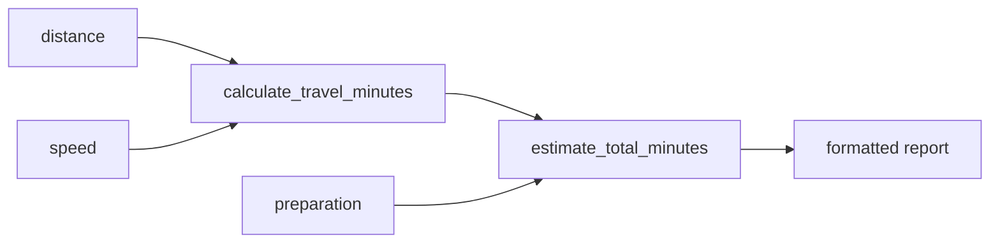

# Lesson 3 — Functions and Expressions

## Goal

Separate business calculations into named, reusable functions.

## A function is a contract

```rust
fn calculate_travel_minutes(distance_km: f64, speed_kmh: f64) -> u32 {
    (distance_km / speed_kmh * 60.0).ceil() as u32
}
```

The signature says:

- The function receives two `f64` values.
- It returns one `u32`.
- Callers do not need to know how it performs the calculation.

Function parameters always declare their types.

## Statements and expressions

Rust distinguishes statements that perform an action from expressions that
produce a value.

```rust
let total = {
    let travel = 24;
    let preparation = 10;
    travel + preparation
};
```

The block is an expression. Its final line has no semicolon, so its value becomes
the value assigned to `total`. Adding a semicolon changes that line into a
statement and prevents the block from returning the number.

An explicit `return` works, but an ending expression is idiomatic for the normal
result:

```rust
fn add_preparation(travel: u32, preparation: u32) -> u32 {
    travel + preparation
}
```

## Data should flow in one direction



Small pure calculation functions are easy to understand and test: the same
inputs always produce the same output, and they do not read terminal input or
print anything.

## Predict

Which version returns `7`?

```rust
fn version_a() -> u32 {
    3 + 4
}

fn version_b() -> u32 {
    3 + 4;
}
```

Ask the compiler to check both, then explain the relevant part of its message.

## Build the project: checkpoint 3

Extract the checkpoint 2 logic into:

```rust
fn calculate_travel_minutes(distance_km: f64, speed_kmh: f64) -> u32

fn estimate_total_minutes(travel_minutes: u32, preparation_minutes: u32) -> u32
```

Keep `main` responsible for:

1. Defining the input values
2. Calling the functions
3. Printing the report

Call `calculate_travel_minutes` with at least two sets of values to demonstrate
that it is reusable.

## Common traps

- Omitting parameter types
- Putting a semicolon after the intended return expression
- Making a calculation function print instead of return its answer
- Hiding fixed business values inside a function when they should be parameters

## Check your understanding

1. What does `-> u32` promise to the caller?
2. Why are input and output kept outside calculation functions?
3. When would an explicit `return` improve clarity?

Continue to [Lesson 4](04-decisions-and-repetition.md).
