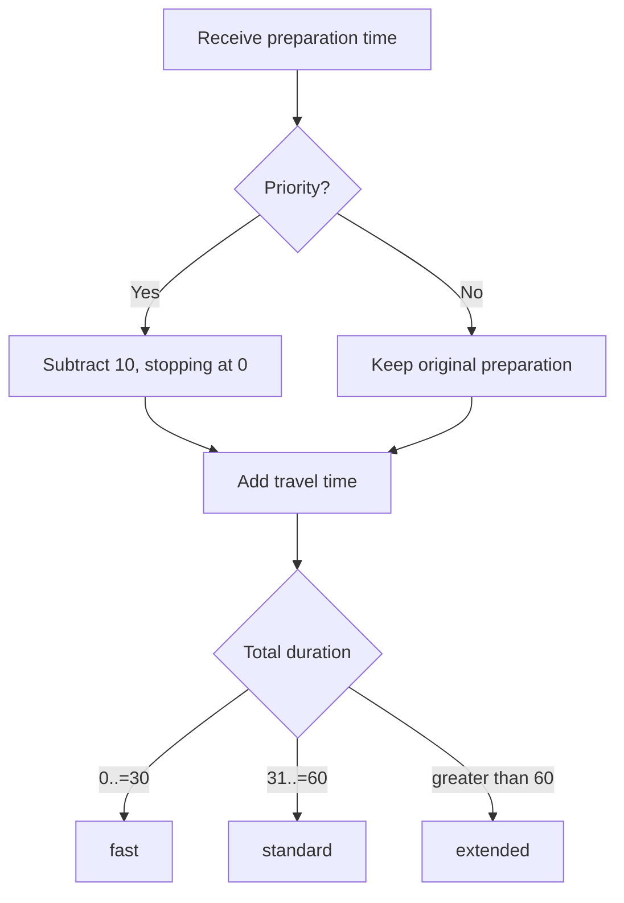

# Lesson 4 — Decisions and Repetition

## Goal

Express business rules with control flow and repeat an operation until the
program receives usable data.

## `if` is an expression

Priority deliveries reduce preparation time by 10 minutes, but preparation can
never become negative:

```rust
fn adjusted_preparation_minutes(preparation: u32, is_priority: bool) -> u32 {
    if is_priority {
        preparation.saturating_sub(10)
    } else {
        preparation
    }
}
```

Both branches return `u32`, so the whole `if` expression returns `u32`.
`saturating_sub` stops at zero instead of underflowing.

## Classify the result

```rust
fn delivery_band(total_minutes: u32) -> &'static str {
    match total_minutes {
        0..=30 => "fast",
        31..=60 => "standard",
        _ => "extended",
    }
}
```

`match` compares a value against patterns. Rust checks that every possible value
is handled; `_` handles everything not matched earlier.

The return type means “a string slice that is valid for the entire program.”
Ownership and lifetimes explain this notation fully in later modules. For now,
each returned string is fixed text embedded in the executable.

## Repeat until a condition is met

```rust
let mut attempts = 0;

loop {
    attempts += 1;

    if attempts == 3 {
        break;
    }
}
```

Rust also provides `while` for conditional repetition and `for` for visiting
items from an iterator or range:

```rust
for minute in 1..=3 {
    println!("Minute {minute}");
}
```

## Control-flow map



## Predict

Determine the output for:

```rust
for preparation in [5, 10, 25] {
    let adjusted = adjusted_preparation_minutes(preparation, true);
    println!("{preparation} -> {adjusted}");
}
```

Why is ordinary subtraction risky for the first case?

## Build the project: checkpoint 4

Add the two functions shown above. Update the report to contain:

- Original preparation time
- Whether priority was selected
- Adjusted preparation time
- Total estimated time
- Delivery band

Test the boundary totals `30`, `31`, `60`, and `61`.

## Common traps

- Writing `if is_priority == true` when `if is_priority` is clearer
- Returning different types from different branches
- Forgetting a catch-all pattern in `match`
- Creating a loop with no reachable `break`
- Using ordinary unsigned subtraction when the result may go below zero

## Check your understanding

1. How can `if` directly supply a value to a binding?
2. What does exhaustive matching protect against?
3. When would you choose `for`, `while`, or `loop`?

Continue to [Lesson 5](05-terminal-input.md).
