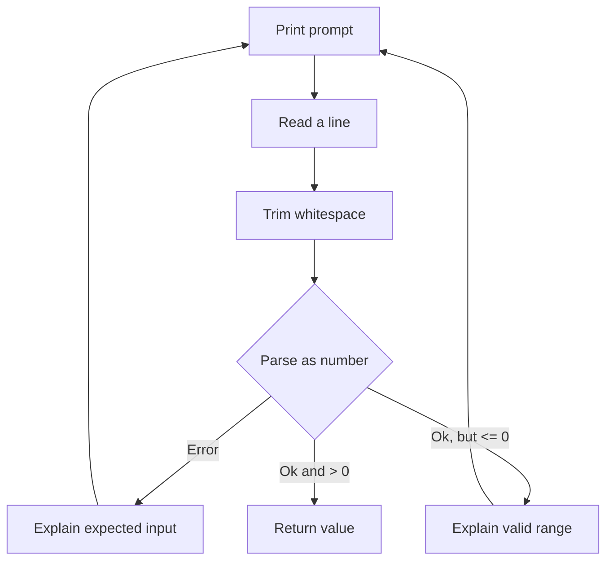

# Lesson 5 — Terminal Input

## Goal

Turn the fixed calculation into an interactive program and recognize failure as
data that must be handled.

## Input arrives as text

```rust
use std::io;

let mut input = String::new();
io::stdin()
    .read_line(&mut input)
    .expect("failed to read input");
```

`String::new()` creates owned, growable text. `read_line` appends terminal input
to it, so the binding and the reference passed to the method must be mutable.

The `&mut` syntax is a mutable borrow. Module 2 develops a proper mental model
for borrowing. In this lesson, its practical meaning is: temporarily allow
`read_line` to change this string without giving the string away.

## Parsing can fail

```rust
let distance: f64 = input
    .trim()
    .parse()
    .expect("distance must be a number");
```

`trim` removes surrounding whitespace, including the newline produced when the
user presses Enter. `parse` returns `Result`: either `Ok(value)` or `Err(error)`.

For friendly input validation, handle both possibilities:

```rust
match input.trim().parse::<f64>() {
    Ok(value) if value > 0.0 => break value,
    Ok(_) => println!("Enter a number greater than zero."),
    Err(_) => println!("Enter a valid number."),
}
```

This `match` can live inside a `loop`. `break value` ends the loop and makes the
loop expression produce `value`.



## Flush prompts

`print!` does not add a newline, and terminal output may be buffered:

```rust
use std::io::{self, Write};

print!("Distance in km: ");
io::stdout().flush().expect("failed to flush output");
```

Importing `Write` brings the `flush` method into scope.

## Predict

For each input, identify the matching branch:

```text
12.5
0
ten
```

Then extend the condition to reject non-finite values such as `NaN`. The method
`value.is_finite()` is useful here.

## Build the project: checkpoint 5

Make the program ask for:

1. Distance in kilometres
2. Average speed in kilometres per hour
3. Preparation time in whole minutes
4. Priority service as `y` or `n`

Use loops so invalid values receive a clear message and another attempt. Keep
input functions separate from calculation functions.

Suggested signatures (the `Option` return is a preview of a type covered in
Module 3; it lets the program stop cleanly if terminal input ends):

```rust
fn read_positive_f64(prompt: &str) -> Option<f64>
fn read_u32(prompt: &str) -> Option<u32>
fn read_yes_no(prompt: &str) -> Option<bool>
```

The `&str` parameter lets the functions read prompt text without taking
ownership of it. Module 2 will explain why this is useful.

## Common traps

- Parsing before calling `trim`
- Accepting `0` as an average speed and later dividing by zero
- Reusing a `String` without clearing it before another `read_line`
- Calling `unwrap` or `expect` on normal user mistakes
- Mixing terminal interaction into calculation functions
- Ignoring `read_line` returning `0`, which means the input stream ended

## Check your understanding

1. Why does terminal input begin as a `String`?
2. What are the two broad states of a `Result`?
3. Why should malformed user input cause another prompt rather than a panic?

Continue to the [cumulative practical](06-practical-delivery-estimator.md).
