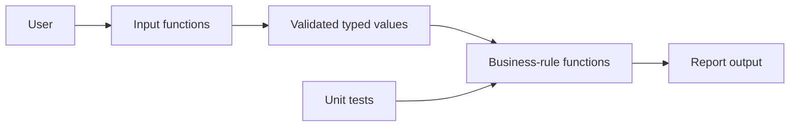

# Practical — Delivery Estimator

## Scenario

A local dispatch desk needs a small terminal tool for quoting delivery times.
The estimate combines preparation time with travel time and applies a priority
service rule.

This practical compounds every lesson in the module:

| Requirement | Knowledge used |
|---|---|
| Build and run a package | Cargo and compiler workflow |
| Store operational data | Bindings and scalar types |
| Calculate independent values | Functions and expressions |
| Apply service rules | `if`, `match`, ranges |
| Accept imperfect input | `String`, loops, parsing, `Result` preview |
| Prove boundary behavior | Unit tests |

## Business rules

1. Distance must be a finite number greater than zero.
2. Average speed must be a finite number greater than zero.
3. Preparation time is a non-negative whole number of minutes.
4. Travel time is `distance / speed * 60`, rounded upward.
5. Priority service reduces preparation by 10 minutes, stopping at zero.
6. The total is adjusted preparation plus travel time.
7. Totals are classified as:
   - `fast`: 0–30 minutes
   - `standard`: 31–60 minutes
   - `extended`: more than 60 minutes

## Expected interaction

```text
Delivery Desk — quick quote
Answer four questions and I’ll build a customer-ready estimate.

New delivery
------------
Distance (km, e.g. 12.5): 12
Expected average speed (km/h): 30
Preparation time (whole minutes): 10
Priority service? (y/n): n

Your quote
----------
Travel                24 min
Preparation           10 min
Priority saving        0 min
                      ----
Estimated total       34 min
Standard window — a comfortable same-hour estimate.

Quote another delivery? (y/n): n
Thanks — the desk is ready when you need another quote.
```

## Build order

Do not write the entire application in one pass.

1. Implement `calculate_travel_minutes`.
2. Implement `adjusted_preparation_minutes`.
3. Implement `estimate_total_minutes`.
4. Implement `delivery_band`.
5. Add the report using fixed inputs.
6. Add one input function at a time.
7. Add or complete tests.
8. Run the quality checks.

The separation should look like this:



## Starter and solution

Open the [starter source](practical/starter/src/main.rs) and complete every
`TODO`. The project compiles before you start, making it possible to improve one
function at a time.

The [reference solution](practical/solution/src/main.rs) demonstrates one
possible design. Compare behavior and function boundaries, not just individual
lines.

Run either project from its directory:

```console
cargo run
cargo test
cargo fmt --check
cargo clippy -- -D warnings
```

## Acceptance checklist

- Valid decimal distances and speeds are accepted.
- Zero, negative, non-numeric, infinite, and `NaN` values are rejected.
- Invalid preparation times are rejected without crashing.
- `y`, `yes`, `n`, and `no` work regardless of capitalization.
- Priority adjustment never underflows.
- Boundary classifications at 30, 31, 60, and 61 are correct.
- Calculation functions do not read or print.
- Parsing rules can be tested without replacing terminal input.
- End-of-input exits cleanly instead of prompting forever.
- Totals saturate at `u32::MAX` instead of overflowing.
- Several quotes can be prepared without restarting the program.
- The report explains what the delivery band means to a customer.
- The completed code passes all tests and Clippy with warnings denied.

## Hints

<details>
<summary>Hint 1: Returning a value from a validation loop</summary>

Use `break value` inside `loop`. Assign the loop itself:

```rust
let value = loop {
    // ...
    break parsed_value;
};
```

</details>

<details>
<summary>Hint 2: Case-insensitive yes/no input</summary>

Match on `input.trim().to_ascii_lowercase().as_str()`.

</details>

<details>
<summary>Hint 3: Test calculations without terminal input</summary>

Keep calculations in functions whose arguments and results are ordinary numeric
or string-slice values. Unit tests can call those functions directly.

</details>

## Optional extensions

Complete these only after the acceptance checklist passes:

1. Add a 5-minute pickup handoff cost.
2. Track several deliveries and print the average estimate.
3. Print a warning when the average speed exceeds 130 km/h.
4. Add a `cargo test` case before implementing each new rule.

## Reflection

Write short answers:

1. Which values changed during the program, and which stayed immutable?
2. Which functions encode business policy rather than terminal behavior?
3. Which invalid input revealed the most about Rust’s types?
4. What would become difficult if all logic remained inside `main`?
