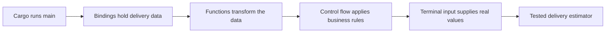

# Module 1 — Foundations

## Outcome

By the end of this module, you will build a command-line tool that estimates a
delivery time from distance, speed, preparation time, and service priority.

This module is based mainly on:

- [Rust Book Chapter 1: Getting Started](https://doc.rust-lang.org/book/ch01-00-getting-started.html)
- [Rust Book Chapter 3: Common Programming Concepts](https://doc.rust-lang.org/book/ch03-00-common-programming-concepts.html)
- The input-driven approach introduced in
  [Chapter 2’s guessing game](https://doc.rust-lang.org/book/ch02-00-guessing-game-tutorial.html)

Error handling is deliberately introduced only as a preview. It receives full
treatment in a later module based on Chapter 9.

## Lesson sequence

| Lesson | New knowledge | Project checkpoint |
|---|---|---|
| [1. Cargo and the compiler](01-cargo-and-the-compiler.md) | Packages, source, compilation, macros | Print a fixed delivery report |
| [2. Bindings and types](02-bindings-and-types.md) | `let`, `mut`, scalar types, arithmetic | Calculate travel time |
| [3. Functions and expressions](03-functions-and-expressions.md) | Parameters, return types, expression values | Extract estimation functions |
| [4. Decisions and repetition](04-decisions-and-repetition.md) | `if`, `match`, `loop`, ranges | Apply business rules and validate |
| [5. Terminal input](05-terminal-input.md) | `String`, parsing, `Result` preview | Make the estimate interactive |
| [Practical](06-practical-delivery-estimator.md) | Combine and test everything | Complete the CLI |

## Knowledge dependency map

Do the lessons in order. Each checkpoint assumes the previous checkpoint has
been completed.

## Estimated effort

- Lessons: 3–5 hours
- Practical: 2–4 hours
- Optional challenges: 1–2 hours

The time is intentionally flexible. Being able to explain the code matters more
than finishing quickly.
