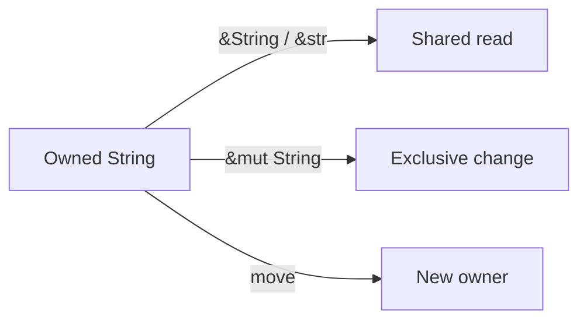

# Module 2 — Ownership and Borrowing

## Outcome

Extend the delivery estimator with customer and address data while making every
ownership transfer deliberate.

This module follows [Rust Book Chapter 4](https://doc.rust-lang.org/book/ch04-00-understanding-ownership.html).

## Lesson sequence

| Lesson | New knowledge | Project checkpoint |
|---|---|---|
| [1. Owned strings](01-owned-strings.md) | Stack values, heap data, `String` | Store customer data |
| [2. Moves and clones](02-moves-and-clones.md) | Ownership transfer, explicit duplication | Observe and repair a move |
| [3. Shared borrowing](03-shared-borrowing.md) | `&T`, read-only access | Format without consuming |
| [4. Mutable borrowing](04-mutable-borrowing.md) | `&mut T`, exclusivity | Correct a customer name |
| [5. String slices](05-string-slices.md) | `&str`, ranges, UTF-8-safe APIs | Inspect text without copying |
| [Practical](06-practical-customer-data.md) | Combine ownership choices | Build a delivery label |

Estimated effort: 5–8 hours.
