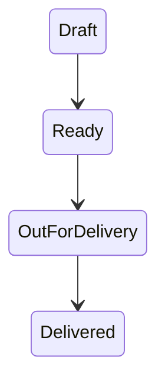

# Module 3 — Modeling a Domain

## Outcome

Replace loosely related values with an `Order` type whose states and operations
express the delivery domain.

This module follows [Rust Book Chapter 5](https://doc.rust-lang.org/book/ch05-00-structs.html)
and [Chapter 6](https://doc.rust-lang.org/book/ch06-00-enums.html).

## Lesson sequence

| Lesson | Main idea | Checkpoint |
|---|---|---|
| [1. Structs](01-structs.md) | Named related data | Define `Order` |
| [2. Methods](02-methods.md) | Behavior attached to a type | Add summaries |
| [3. Enums](03-enums.md) | One value from a closed set | Model status |
| [4. Optional data](04-option.md) | Presence or absence | Optional notes |
| [5. Pattern matching](05-pattern-matching.md) | Exhaustive state handling | Choose next actions |
| [Practical](06-practical-orders.md) | Combined domain model | Process one order |

