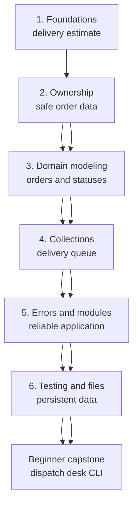

# Beginner Rust Curriculum

This curriculum follows the progression of the official Rust Book while
splitting large subjects into smaller learning loops. Each module ends in a
practical milestone, and the milestones build toward one larger capstone.

## Learning path



## Modules

| Module | Rust Book basis | Main ideas | Practical milestone |
|---|---|---|---|
| [1. Foundations](01-foundations/README.md) | Chapters 1–3, with a preview of Chapter 9 | Cargo, bindings, types, functions, expressions, control flow, input | Estimate one delivery |
| [2. Ownership and borrowing](02-ownership/README.md) | Chapter 4 | Stack and heap, moves, borrowing, references, slices, `String` | Pass customer and address data safely |
| [3. Modeling a domain](03-domain-modeling/README.md) | Chapters 5–6 | Structs, methods, enums, `Option`, `match`, `if let` | Model orders and delivery states |
| [4. Useful collections](04-collections/README.md) | Chapter 8 | Vectors, strings, hash maps, iteration | Maintain and summarize a delivery queue |
| [5. Reliable program structure](05-reliable-structure/README.md) | Chapters 7 and 9 | Packages, modules, visibility, `Result`, error propagation | Split the app and report recoverable errors |
| [6. Tests, traits, and files](06-tests-traits-files/README.md) | Chapters 10–11 and relevant standard-library docs | Generics, traits, lifetimes at a beginner level, tests, file I/O | Save, load, and test dispatch data |
| [Capstone](capstone/README.md) | Combined knowledge | Requirements, decomposition, refactoring, documentation | Build a dispatch-desk CLI |

## How knowledge accumulates

The course does not discard the previous module’s project. The initial delivery
calculator gradually becomes a small dispatch application:

```text
number calculation
  -> interactive estimate
  -> typed Order value
  -> queue of orders
  -> modular error-aware application
  -> saved and tested dispatch desk
```

Each module uses four kinds of work:

1. **Understand:** a short explanation and a diagram where it improves the
   mental model.
2. **Predict:** decide what a snippet does before running it.
3. **Experiment:** make a small change and use compiler feedback.
4. **Build:** add one meaningful behavior to the practical project.

## Source policy

The course links back to relevant Rust Book sections and uses its conceptual
sequence. Explanations, examples, exercises, and the delivery domain are written
specifically for this course. When the Book changes, the curriculum mapping
should be reviewed.

## Repository quality checks

From Git Bash at the repository root, run:

```console
bash scripts/check.sh
```

This validates formatting, Clippy, all starter and solution tests, and local
documentation links.
