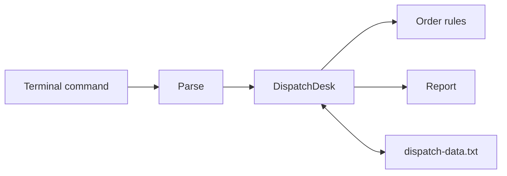

# Capstone — Dispatch Desk CLI

## Goal

Combine the course into a small terminal application that estimates, queues,
dispatches, completes, searches, summarizes, saves, and reloads deliveries.

## What you are expected to design

Before coding, write down:

1. The data required to create an order.
2. The valid status transitions.
3. Which failures belong to domain validation, command parsing, and storage.
4. Which functions borrow data and which must own it.
5. The tests that prove boundaries and a persistence round trip.



## Commands

| Command | Purpose |
|---|---|
| `new` or `add` | Queue an order through friendly prompts |
| `add CUSTOMER|ADDRESS|DISTANCE|SPEED|PREPARATION|PRIORITY` | Fast entry for experienced users |
| `list` | Show every order |
| `find QUERY` | Search customers and addresses |
| `dispatch ID COURIER` | Assign a ready order |
| `deliver ID` | Complete an out-for-delivery order |
| `summary` | Count each status |
| `save` | Persist immediately |
| `help` | Show command help |
| `quit` | Save and exit |

Priority accepts `yes`, `y`, `no`, or `n`. Distance and speed must be positive
finite numbers; preparation is a non-negative whole number.

Changes auto-save after adding, dispatching, or completing an order. Enter
`cancel` during guided entry to return to the board without changing anything.
Command names are case-insensitive, and common shortcuts include `ls`, `search`,
`status`, `?`, and `q`.

## Example shift

```text
Dispatch Desk
=============
Fresh board — no saved orders yet.
Enter new for guided entry, or help for every command.

dispatch> new

Let’s put a delivery on the board.
Type cancel at any prompt to leave without saving it.

Customer name: Amina Nuru
Delivery address: 101 Baobab Way
Distance (km): 12
Expected average speed (km/h): 30
Preparation time (minutes): 10
Priority service? (y/n): yes
Order #1 is on the board — about 24 minutes. Saved.

dispatch> dispatch 1 Noor Rahman
Order #1 is out with Noor Rahman. Saved.

dispatch> summary

Shift snapshot
  Ready                   0
  Out for delivery        1
  Delivered               0
                         ---
  Total                   1
```

## Build stages

1. Implement estimates and validation in `model.rs`.
2. Implement status transitions.
3. Implement queue operations in `DispatchDesk`.
4. Parse commands separately from executing them.
5. Implement the text store and contextual errors.
6. Connect the terminal loop.
7. Add unit and end-to-end persistence tests.

Start from [the capstone scaffold](starter/src/lib.rs). Use the
[reference solution](solution/src/lib.rs) only after completing a stage.

## Definition of done

- Invalid input returns a useful error and does not crash.
- IDs remain stable across save and reload.
- Only ready orders can be dispatched.
- Only out-for-delivery orders can be completed.
- Search is case-insensitive.
- Empty boards and searches explain the useful next action.
- Mutating commands save immediately and report what changed.
- Guided entry can be cancelled safely at any prompt.
- Estimate boundaries and every transition are tested.
- A persistence round trip is tested through the public API.
- `bash scripts/check.sh` succeeds at the repository root.

## Optional extensions

- Replace the text format with a carefully selected serialization dependency.
- Add cancellation and reassignment transitions.
- Sort queue reports by estimate or priority.
- Write a migration strategy for future storage formats.
