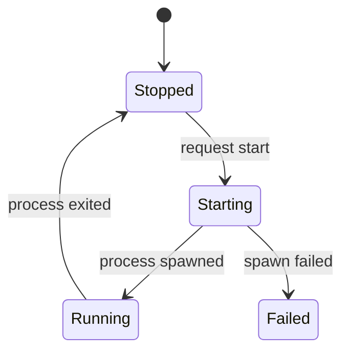

# Service State and Processes

## Goal

Model a service lifecycle so invalid states are difficult to represent, then
launch one named child process and record its exit.

## Start with the state machine

The state owns only the data that is valid at that moment:

```rust
#[derive(Debug, PartialEq, Eq)]
pub enum ServiceState {
    Stopped { last_exit_code: Option<i32> },
    Starting,
    Running { pid: u32 },
    Failed { message: String },
}
```

There is no separate `is_running` boolean that can disagree with an optional
process identifier. A running service always has a process identifier. A
stopped service may have the last observed exit code.



## Predict the transition

What should happen if `ProcessExited` is applied while the service is still
`Stopped`?

Do not silently accept it. Return a `TransitionError` that reports the current
state and attempted event. The caller then decides whether to log, retry, or
surface the invalid operation.

## Design the ownership

Use this table before changing the implementation. It is the recurring design
checkpoint for this route.

| Question | Current decision |
|---|---|
| Created by | Application setup |
| Owned by | `Supervisor` owns the service definition and current state |
| Borrowed by | Process launch code reads `&ServiceDefinition` |
| Mutated by | `Supervisor` has exclusive mutation authority over state |
| Crosses threads | Nothing yet |
| Destroyed when | The supervisor is dropped |
| Clone justified? | Only when an independent run summary or error must retain the service name |

The launcher does not keep the configuration, so it borrows it. The supervisor
owns state because it is responsible for the complete process lifecycle.

## Work in your editor

Open `projects/service-runner/01-state-and-processes`. Read the transition tests
before the implementation, then run:

```console
cargo test -p service_runner_state
cargo run -p service_runner_state
```

The executable launches a child copy of itself in worker mode. This avoids
shell-specific commands and behaves consistently on Windows, macOS, and Linux.

## Trace the lifecycle

Follow the state changes in `Supervisor::run_to_completion`:

1. `StartRequested` changes `Stopped` to `Starting`.
2. `Command::spawn` launches the configured program.
3. `ProcessSpawned` stores the child process identifier.
4. `Child::wait` waits for completion.
5. `ProcessExited` returns the service to `Stopped` with an optional exit code.
6. A launch or wait failure moves the service to `Failed` and returns a
   contextual `RunError`.

## Make a meaningful change

Add a test proving that a second `StartRequested` event fails while the state
is `Starting`. Then add a `status_line` function that returns one useful line
for every state without using a wildcard match.

The exhaustive match is important. Adding a later `Stopping` state should make
the compiler identify every status view that needs a decision.

## Compare the weaker design

This shape compiles, but it permits contradictions:

```rust
struct LooseServiceState {
    running: bool,
    pid: Option<u32>,
    failed: bool,
    message: Option<String>,
}
```

It can represent `running: false` with `pid: Some(42)`, or `failed: false` with
an error message. The enum removes those combinations instead of asking every
caller to remember validation rules.

## Rust judgment

Why wait synchronously in this checkpoint?

There is only one process and no concurrent log stream. Threads or async tasks
would add coordination without solving an existing problem. The next project
checkpoint should introduce concurrency only when stdout and stderr must be read
while the process is running.

Return to the [experienced route overview](README.md) and check the definition
of done.
