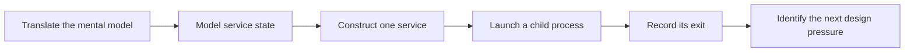

# Rust for Experienced Developers

## Outcome

Build a small local service runner while learning the Rust decisions that do
not translate directly from Go or TypeScript.

This is an overlay on the beginner course, not a separate curriculum. You can
move quickly through familiar material and open a focused foundational lesson
when Rust behaves differently from the languages you already use.

## Who this route is for

Use this route if you can already design applications, write tests, debug
production code, and work comfortably with a typed language. You do not need
prior systems-programming experience.

The route assumes you understand variables, functions, loops, data structures,
modules, and ordinary application errors. Its focus is Rust judgment:

- deciding who owns data and when borrowing is appropriate
- modeling states and failures explicitly
- interpreting compiler feedback as architectural feedback
- managing native resources and process lifecycles
- choosing concrete code before introducing abstraction

## First checkpoint

The first checkpoint is intentionally narrow. You will:

1. Translate six familiar concepts from Go and TypeScript into Rust.
2. Model a service lifecycle with an enum and exhaustive transitions.
3. Construct one named service definition directly in Rust.
4. Launch a child process and retain its process identifier.
5. Wait for completion and record its exit code.
6. Test valid and invalid state transitions.

Configuration files, concurrent log streaming, trait-based process boundaries,
async Rust, ConPTY, and FFI are deferred until the project creates a real need
for them.

## Learning route

| Work | Purpose | Use the beginner course when needed |
|---|---|---|
| [Rust through Go and TypeScript](01-rust-through-go-and-typescript.md) | Replace misleading translations with a compact Rust mental model | [Moves and clones](../02-ownership/02-moves-and-clones.md), [Optional data](../03-domain-modeling/04-option.md) |
| [Service state and processes](02-service-state-and-processes.md) | Make invalid states harder to represent, then launch one process | [Enums](../03-domain-modeling/03-enums.md), [Pattern matching](../03-domain-modeling/05-pattern-matching.md), [Recoverable errors](../05-reliable-structure/03-recoverable-errors.md) |

## Definition of done

You have completed this slice when:

- `cargo test -p service_runner_state` succeeds
- `cargo run -p service_runner_state` launches the example worker
- the output reports the service name, process identifier, and exit code
- you can explain why the supervisor owns the mutable state
- you can explain why the process launcher borrows the service definition
- you can add one invalid transition test without consulting the solution

Start with [Rust through Go and TypeScript](01-rust-through-go-and-typescript.md).
